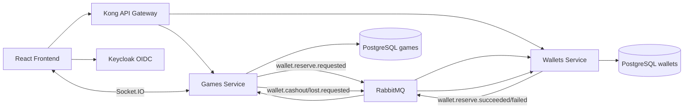

# Crash Game

Implementacao full-stack de um Crash Game multiplayer em tempo real, com frontend em React/Vite, dois servicos NestJS, comunicacao assincrona via RabbitMQ, autenticacao OIDC com Keycloak e gateway Kong.

## Como Rodar

Prerequisitos:

- Bun 1.x ou superior
- Docker e Docker Compose

Na raiz do projeto:

```bash
bun install
bun run docker:up
```

O comando `bun run docker:up` faz build e recria os containers para evitar imagens antigas:

```bash
docker compose up --build --force-recreate
```

URLs principais:

| Servico | URL |
| --- | --- |
| Frontend | `http://localhost:3000` |
| Kong API Gateway | `http://localhost:8000` |
| Keycloak | `http://localhost:8080` |
| RabbitMQ Management | `http://localhost:15672` |
| Game Service direto | `http://localhost:4001` |
| Wallet Service direto | `http://localhost:4002` |

Credenciais de teste:

| Sistema | Usuario | Senha |
| --- | --- | --- |
| Jogo / Keycloak | `player` | `player123` |
| Keycloak admin | `admin` | `admin` |
| RabbitMQ | `admin` | `admin` |

Para parar:

```bash
bun run docker:down
```

Para remover containers, volumes e imagens:

```bash
bun run docker:prune
```

## Como Testar

Com a stack Docker rodando:

```bash
bun test tests/
```

Esse comando roda testes unitarios e E2E dos dois servicos. Os E2E usam Kong e Keycloak reais, entao exigem `bun run docker:up`.

Comandos por servico:

```bash
cd services/games
bun test tests/unit
bun test tests/e2e
bunx tsc --noEmit

cd ../wallets
bun test tests/unit
bun test tests/e2e
bunx tsc --noEmit

cd ../../frontend
bun run build
```

## Arquitetura

O sistema tem dois bounded contexts principais:

- **Games**: controla rodada, apostas, cashout, crash point, eventos em tempo real e provably fair.
- **Wallets**: controla carteira, saldo disponivel, saldo reservado e liquidacao financeira.

Fluxo simplificado:



## API Principal

Todas as rotas abaixo estao disponiveis via Kong em `http://localhost:8000`.
### Wallets

| Metodo | Endpoint | Auth | Descricao |
| --- | --- | --- | --- |
| `GET` | `/wallets/health` | Nao | Health check |
| `POST` | `/wallets` | Sim | Cria ou retorna a carteira do jogador autenticado |
| `GET` | `/wallets/me` | Sim | Consulta saldo disponivel e reservado |

### Games

| Metodo | Endpoint | Auth | Descricao |
| --- | --- | --- | --- |
| `GET` | `/games/health` | Nao | Health check |
| `GET` | `/games/rounds/current` | Nao | Estado atual da rodada |
| `GET` | `/games/rounds/:roundId/verify` | Nao | Dados de verificacao provably fair da rodada atual ou recente |
| `POST` | `/games/bet` | Sim | Aposta na rodada atual |
| `POST` | `/games/bet/cashout` | Sim | Faz cashout da aposta pendente |

Exemplo de resposta de verificacao antes do crash:

```json
{
  "roundId": "uuid",
  "crashPoint": 482,
  "serverSeedHash": "sha256...",
  "clientSeed": "development-client-seed",
  "nonce": 1,
  "revealed": false
}
```

Exemplo apos a rodada ser encerrada:

```json
{
  "roundId": "uuid",
  "crashPoint": 482,
  "serverSeedHash": "sha256...",
  "clientSeed": "development-client-seed",
  "nonce": 1,
  "revealed": true,
  "serverSeed": "development-server-seed-1",
  "verified": true
}
```

## Testes Existentes

- Unitarios de `Round`, `Bet`, `ProvablyFair`, casos de uso de aposta/cashout e reserva.
- Unitarios de `Wallet`, criacao/consulta de carteira e reserva de saldo.
- E2E de Games cobrindo autenticacao obrigatoria, obtencao de token Keycloak, criacao de carteira, verificacao provably fair e reserva de aposta via RabbitMQ.
- E2E de Wallet cobrindo autenticacao obrigatoria, criacao de carteira e consulta de carteira autenticada.

## Decisoes De Implementacao

- **Dinheiro em centavos inteiros**: o backend usa `bigint` e nunca usa ponto flutuante para saldo, reserva ou payout.
- **Reserva assincrona de carteira**: ao apostar, o Games registra a aposta e publica `wallet.reserve.requested`. A Wallet responde com sucesso ou falha via RabbitMQ. Se houver saldo insuficiente, o Games marca a aposta como `REFUNDED` e emite `bet:rejected` via WebSocket.
- **JWT validado no backend**: endpoints protegidos nao confiam em `x-player-id`. Eles exigem `Authorization: Bearer <token>` do Keycloak e validam assinatura RS256, issuer, expiracao e client id via JWKS.
- **Rodadas automaticas**: a rodada abre em fase `BETTING`, inicia por timer sem depender de aposta, executa ticks de multiplicador, crasha e abre uma nova rodada apos cooldown.
- **Tempo real server-to-client**: WebSocket e usado para sincronizar abas com eventos de rodada, aposta, cashout e rejeicao.
- **Provably fair deterministico**: cada rodada tem `serverSeedHash` exposto antes do crash. A seed so e revelada no endpoint de verificacao quando a rodada ja esta `CRASHED` ou `SETTLED`.

## Trade-offs

Trade-off e uma escolha consciente entre custo e beneficio. Neste projeto, os principais sao:

- **Rodadas e apostas do Games ficam em memoria**: isso simplifica o game loop e deixa o desafio funcional dentro do tempo. O custo e que historico completo, `/games/bets/me` e verificacao apos restart ainda nao sobrevivem a reinicio do servico. Para mitigar parcialmente, o endpoint `/games/rounds/:roundId/verify` consulta a rodada atual e as ultimas rodadas mantidas em memoria.
- **Sem outbox/inbox transacional**: RabbitMQ garante a comunicacao entre servicos, mas ainda nao ha tabela outbox/inbox para reprocessamento exatamente-uma-vez. As mensagens usam `idempotencyKey`, o que deixa o caminho preparado para essa evolucao.
- **Provably fair com seeds de desenvolvimento**: o algoritmo usa HMAC-SHA256 e e verificavel, mas as seeds sao deterministicas para facilitar reproducibilidade e testes. Em producao, a `serverSeed` deveria vir de fonte criptograficamente aleatoria e preferencialmente de uma hash chain.
- **Frontend sem suite propria de testes**: a validacao automatizada atual cobre backend e E2E de API. O frontend foi validado por build TypeScript/Vite e uso manual, mas ainda nao possui Playwright/Vitest.

## O Que Eu Faria A Seguir

1. Persistir `Round` e `Bet` no banco do Games.
2. Implementar `/games/rounds/history` e `/games/bets/me`.
3. Adicionar outbox/inbox transacional para RabbitMQ.
4. Adicionar Playwright cobrindo login, aposta, cashout e multiplas abas.
5. Evoluir provably fair para hash chain com seed aleatoria por rodada.
